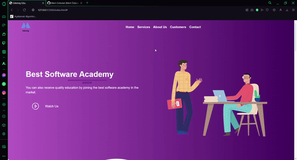

# 🧱Udemig Academy:

This is a responsive and modern web page for Software Academy, built using Bootstrap. The page is designed to provide a seamless user experience across all devices, showcasing the academy's courses, faculty, and other relevant information. The clean and intuitive interface makes it easy for visitors to navigate and find the resources they need.

##

# 🚀Features:
- Responsive Design: Adapts to any screen size, ensuring a consistent experience on desktops, tablets, and smartphones.

- Bootstrap Framework: Utilizes Bootstrap for quick and efficient layout creation and styling.

- Interactive Elements: Includes dropdowns, modals, and other Bootstrap components for enhanced interactivity.

##

# 🌄Preview:

